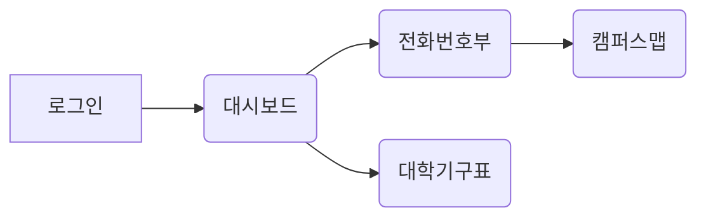
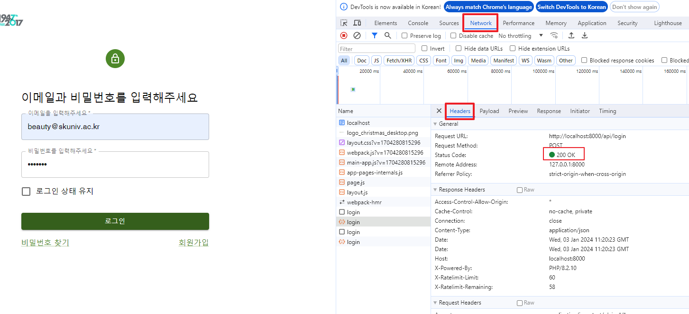
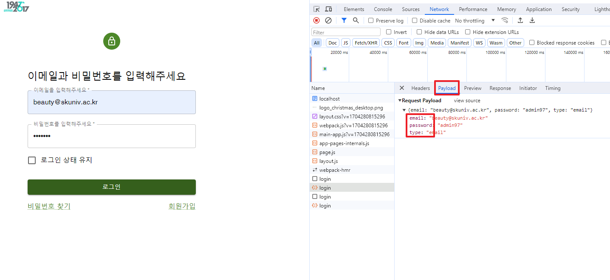
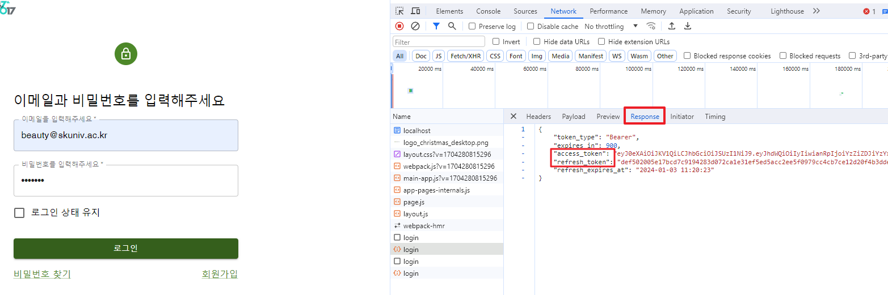
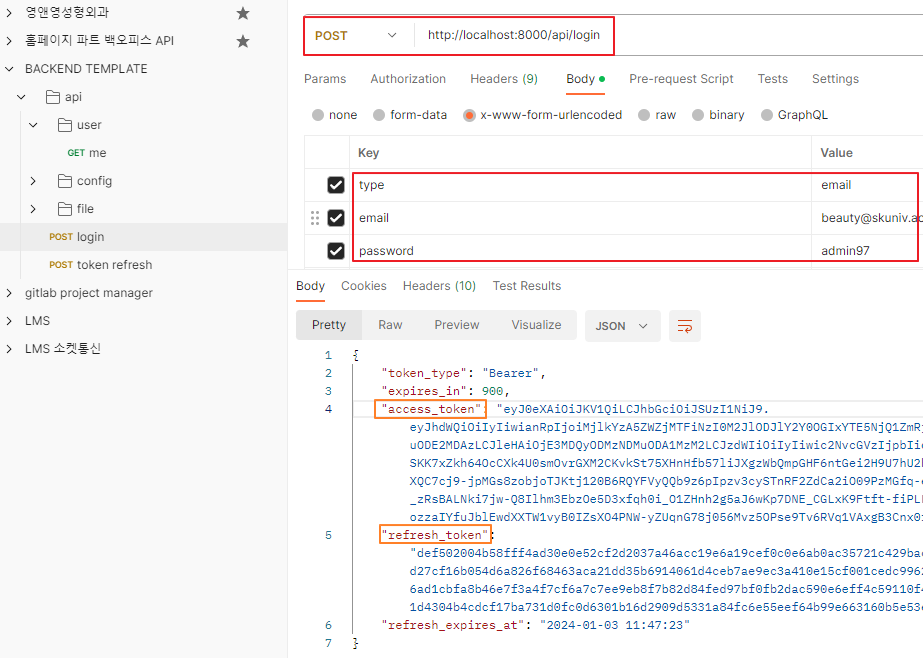

# Next.js 13

- [생활코딩 강의 참고](https://www.youtube.com/playlist?list=PLuHgQVnccGMCwxXsQuEoG-JJ7RlwtNdwJ)

## Full Stack Web Application Framework

1. SSR(Server Side Rendering)
2. App router
3. Server component

## [프로젝트 구조](https://nextjs.org/docs/getting-started/project-structure): page, layout

### src/app/layout.tsx

- 기본적인 웹 페이지의 골격

```agsl
    <html>
      <body>{children}</body>
    </html>
``` 

- {children}은 src/app/page.tsx 에서 가져옴
- src/app/globals.css

## App 라우팅

### 라우팅이란?

- 어떤 콘텐츠를 어떤 방식으로 보여줄 것인지 효율적인 경로를 결정

### 세그먼트(segment): App 하위에 디렉토리 생성

### 파일 규칙

- layout
    - 해당 페이지 공통 layout
    - layout이 없다면 상위 layout이 적용됨
- page
    - layout의 {children} 부분에 들어가는 콘텐츠

### 다이나믹 라우팅

- 디렉토리/[id]

## 배포 (프로젝트 개발 완료 후)

- 크롬 개발자도구-네트워크 에서 새로고침을 해보면 하단에 6.3MB resources 라고 나옴(서버에서 클라이언트로 전송한 용량이 6.3MB나 된다는 것을 의미)
    - 큰 용량은 비효율적이고 보안에 문제가 될 수 있음
- Node js 기반으로 만들어진 프로젝트들은 package.json 파일에서 "script" 안에 프로젝트를 유지보수하기 위한 명령어들이 있음
- "build" 는 실서버를 위한 배포판을 만드는 명령. "start" 는 배포판을 서비스하기 위한 명령.
    - `npm run build` 입력 후 `npm run start`
    - 배포판으로 실행하면 용량이 크게 줄어들 것임

---

## 토이 프로젝트

### 서경대학교 전화번호부 백오피스 개발

- 첫화면: 로그인 페이지
- 로그인하면 네비게이션이 있는 대시보드 화면
- 대시보드에는 전화번호부와 대학기구표가 존재
- 전화번호부에는 캠퍼스맵이 존재



<<<<<<< HEAD

## MUI(Material UI)

- [로그인 페이지 템플릿](https://mui.com/material-ui/getting-started/templates/)

## 로그인 로컬 테스트

1. 로컬 라라벨 백엔드 서버 켜기 `php artisan serve`

- 나는 이미 [laravel passsport 인증](https://jjong-factory.tistory.com/91)까지 구축되어 있는 homepage-backend-template을 사용하였음

2. 로그인 버튼을 클릭했을 때 계정이 백엔드로 post 되도록 설정

- 주고 받는 통신을 위해 **axios** 사용
- post 되는 주소는 백엔드 서버 주소 http://localhost:8000/api/login
- 백엔드에서 요구하는 형식을 맞춰 email, password, type 작성

```agsl
    const onClickConfirmButton = async () => {
        try {
            const response = await axios.post('http://localhost:8000/api/login', {
                email,
                password,
                type: "email",
            }, {
                headers: {
                    'Content-Type': 'application/json',
                }
            });
        } catch (e) {

        }
    }
```

3. 로그인이 잘 되는지 확인하기

- 올바른 계정으로 로그인 했을 때 `개발자 도구 > 네트워크 > 헤더(Headers)`: Status Code가 200이면 로그인 성공
  
- `개발자 도구 > 네트워크 > 페이로드(Payload)`: 요청 형식 확인
  
- `개발자 도구 > 네트워크 > 응답(Response)`: 토큰 발급 확인
  

4. Postman으로 확인하기
   

